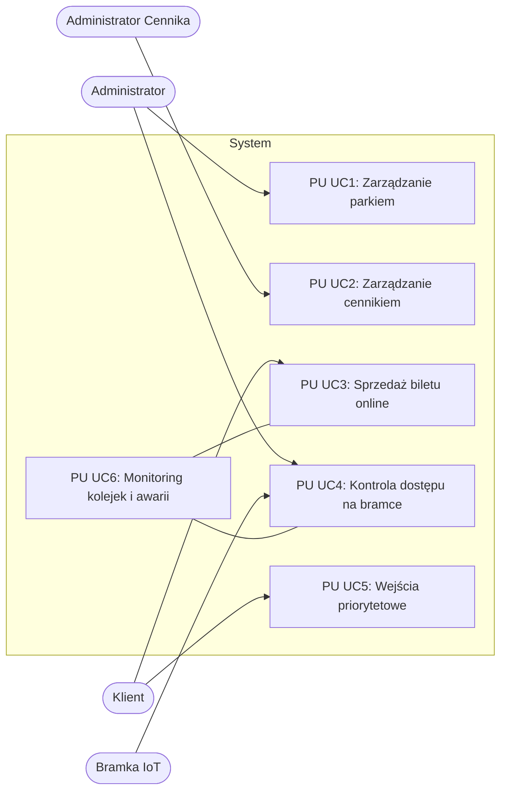
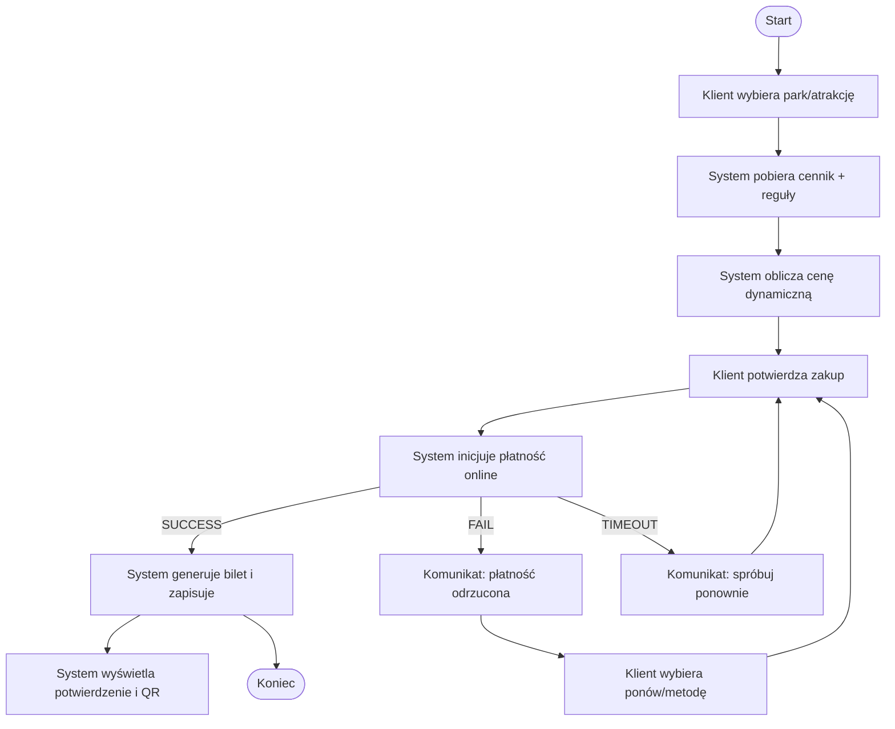
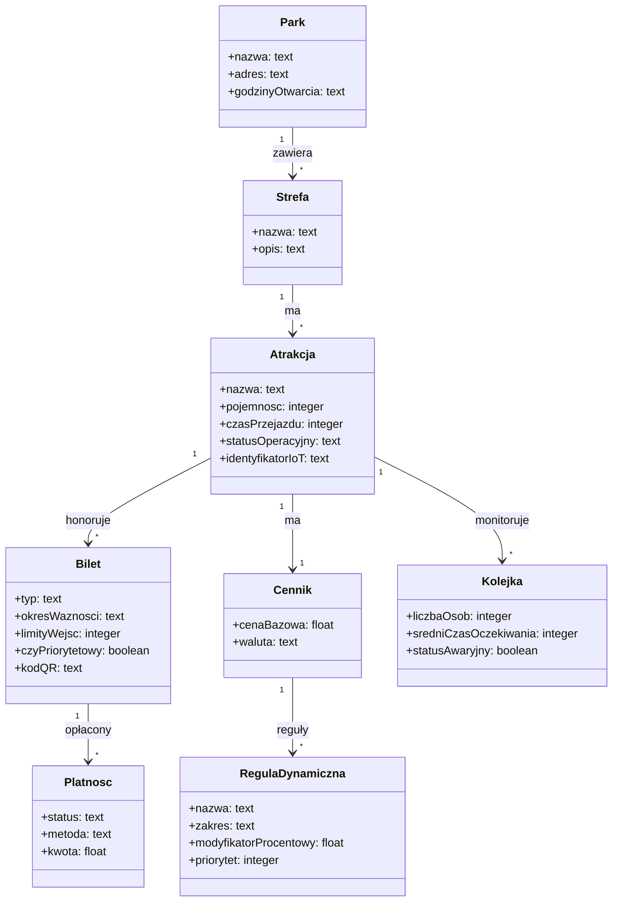
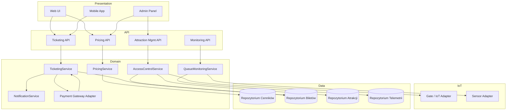
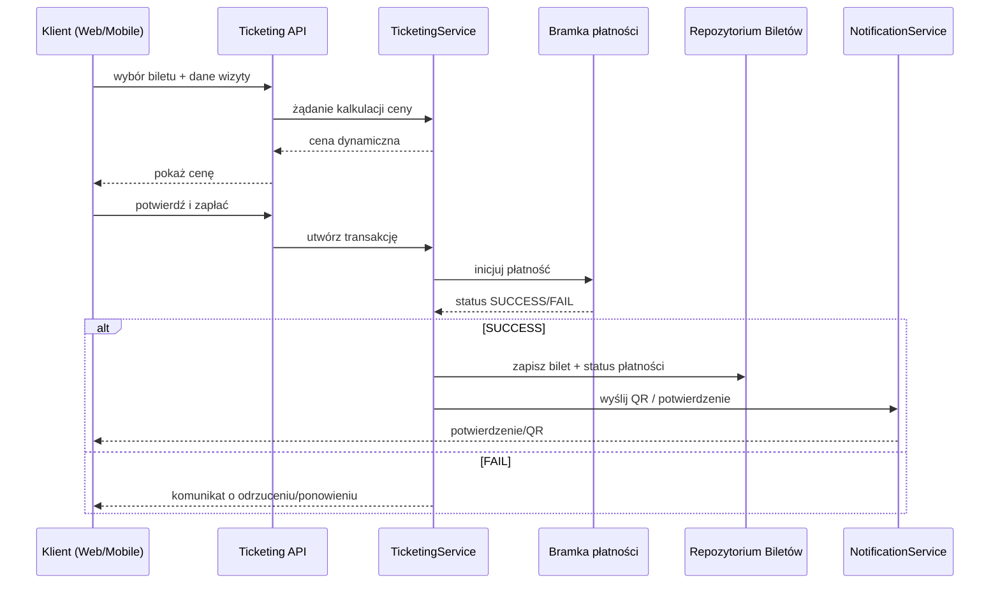
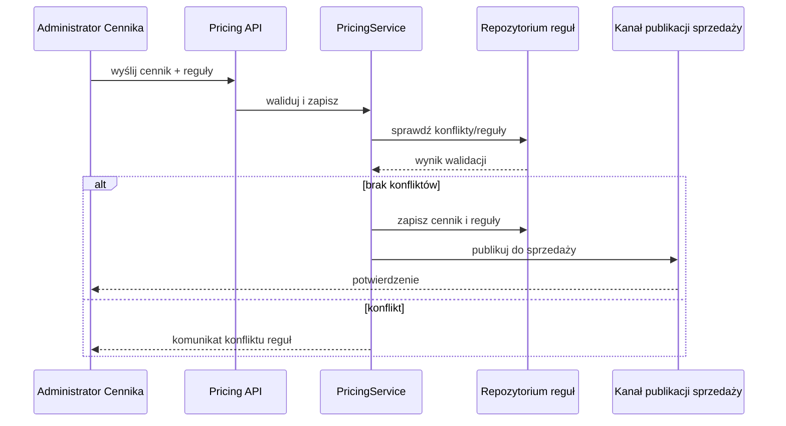
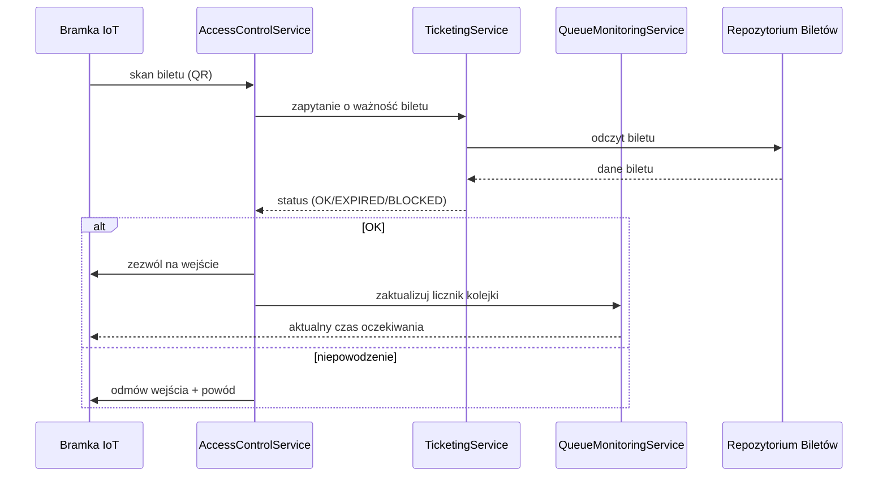
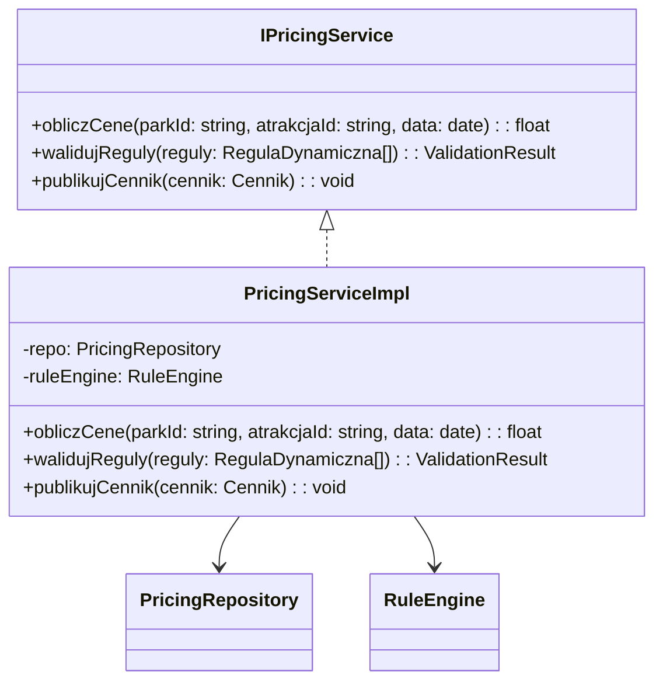

# Plan prac: system obsługi i administracji sieci parków rozrywki

## Cel dokumentu
Przygotowanie zakresu i planu prac analityczno-projektowych zgodnie z wytycznymi zadania projektowego (IO 2025Z). Dokument ma stanowić spójny punkt odniesienia przed opracowaniem pełnej specyfikacji (11–13 stron PDF) oraz ułatwić rozpoczęcie pracy w pierwszych iteracjach Scrum.

## Zakres projektu
- System obejmuje aplikację webową i mobilną dla klientów oraz panel administracyjny.
- Funkcjonalności priorytetowe (pierwsze iteracje):
  - Zarządzanie strukturą parków i atrakcji.
  - Zarządzanie cennikami wraz z dynamicznymi zmianami cen.
  - Sprzedaż i obsługa biletów/karnetów, w tym wejścia priorytetowe.
  - Kontrola dostępu do atrakcji (integracja z bramkami/IoT).
  - Monitoring kolejek i awarii oraz prezentacja informacji klientom.
  - Integracja z płatnościami online.
- Zakres świadomie pomija funkcjonalność generyczną (logowanie/rejestracja użytkowników) zgodnie z wytycznymi.

## Założenia i ograniczenia
- Rozważamy 3–4 pierwsze sprinty o długości 2 tygodni.
- Diagramy UML będą wykonywane w jednym z narzędzi CASE (Modelio/Visual Paradigm/Enterprise Architect) z możliwością eksportu do PDF; do repozytorium trafiają pliki źródłowe diagramów lub zrzuty w formacie PNG/SVG do kompilacji PDF.
- Produkt Backlog używa **przypadków użycia** (nie user stories).
- Iteracje muszą kończyć się przeglądem działającego przyrostu modelu/artefaktów (np. komplet scenariuszy i diagramów dla wybranego zestawu przypadków).

## Rejestr produktowy (Product Backlog — skrót)
Kolejność od najwyższego priorytetu; identyfikatory posłużą dalej w sprintach i scenariuszach. Wagi klienta i szacowania (SP) oparte o szybki poker planistyczny.

| ID | Nazwa przypadku użycia | Krótki opis | Priorytet | Sprint docelowy | Waga klienta | Szacowanie (SP) | Kryterium ukończenia (DoD) |
| --- | --- | --- | --- | --- | --- | --- | --- |
| UC1 | Zarządzanie parkiem | Administrator definiuje/edytuje dane parku, strefy i atrakcji | Wysoki | 1 | 5 | 8 | Diagram PU + opis aktorów + scenariusz główny + warianty błędów |
| UC2 | Zarządzanie cennikiem | Administrator ustala ceny bazowe i reguły dynamiczne (popyt/godzina) | Wysoki | 1 | 5 | 8 | Diagram PU + scenariusz + powiązanie ze słownikiem pojęć |
| UC3 | Sprzedaż biletu online | Klient kupuje bilet/karnet z płatnością online | Wysoki | 1 | 5 | 13 | Diagram PU + scenariusz + diagram aktywności |
| UC4 | Kontrola dostępu na bramce | System weryfikuje bilet/karnet przy wejściu do atrakcji | Wysoki | 2 | 4 | 13 | Diagram PU + scenariusz + sekwencja komponentowa |
| UC5 | Zarządzanie wejściami priorytetowymi | Nadawanie/obsługa priorytetów w kolejce | Średni | 2 | 3 | 8 | Diagram PU + scenariusz |
| UC6 | Monitorowanie kolejek i awarii | System zbiera dane z bramek/IoT i prezentuje je w czasie rzeczywistym | Średni | 2 | 4 | 8 | Diagram PU + scenariusz + integracje |
| UC7 | Raportowanie wykorzystania atrakcji | Generowanie raportów obciążenia | Średni | 3 | 3 | 5 | Diagram PU + scenariusz |
| UC8 | Integracja B2B serwisowa | Serwisy zewnętrzne zgłaszają/aktualizują statusy awarii | Niższy | 3 | 2 | 5 | Diagram PU + scenariusz |

## Sprint 1: Rejestr sprintu (Sprint Backlog)
Celem Sprintu 1 (2 tygodnie, 03.02–16.02) jest przygotowanie pełnego modelu wymagań dla trzech kluczowych przypadków (UC1, UC2, UC3) wraz z wstępną architekturą komponentową.

| Zadanie | Powiązanie | Opis | Odpowiedzialny | Daty | Kryterium ukończenia |
| --- | --- | --- | --- | --- | --- |
| S1-T1 | UC1 | Opracowanie diagramu przypadków użycia i pełnego scenariusza „Zarządzanie parkiem” | Analityk A | 03–06.02 | Diagram PU + scenariusz główny + 2 warianty błędów |
| S1-T2 | UC2 | Opracowanie diagramu PU i scenariusza „Zarządzanie cennikiem” z regułami dynamicznymi | Analityk B | 05–08.02 | Diagram PU + scenariusz + słownik pojęć cenowych |
| S1-T3 | UC3 | Opracowanie diagramu PU, scenariusza i diagramu aktywności „Sprzedaż biletu online” | Analityk C | 06–11.02 | Diagram PU + aktywność + ścieżki błędów płatności |
| S1-T4 | Globalne | Utworzenie słownika dziedziny i diagramu klas pojęć | Zespół | 03–12.02 | Diagram klas z atrybutami/krotnościami powiązanymi z PU |
| S1-T5 | Architektura | Wstępny diagram komponentów warstwowych + opis | Architekt | 09–13.02 | Diagram + krótki opis warstw i interfejsów |
| S1-T6 | Repozytorium | Złożenie szkicu dokumentu PDF (11–13 stron) w oparciu o wzorzec | Scrum Master | 12–16.02 | Struktura sekcji + zrzuty diagramów + numeracja |

## Diagram przypadków użycia (PU)


## Wybrane scenariusze (draft)
### Scenariusze w notacji RSL-bis (główne przypadki sprintu 1)
Poniższe szkice są zgodne z zasadą jednego przypadku użycia „Start” oraz z ograniczeniami kolejności akcji (system/aktor). Numeracja etykiet ułatwia późniejsze diagramy sekwencji i aktywności.

**Use case Start** Main scenario  
00: Użytkownik \<select> aplikacja główna  
01: System \<show> menu główne  
02: Użytkownik \<invoke> UC1: Zarządzanie parkiem, UC2: Zarządzanie cennikiem, UC3: Sprzedaż biletu online  
-> rejoin 01

**Use case UC1: Zarządzanie parkiem** Main scenario  
00: Administrator \<select> otwórz zarządzanie parkiem  
01: System \<show> ekran park list  
02: Administrator \<enter> park  
03: Administrator \<select> edytuj park  
04: System \<show> ekran park form  
05: Administrator \<enter> park szczegóły, strefa lista, atrakcja lista  
06: Administrator \<select> zapisz park  
07: System \<check> park, strefa lista, atrakcja lista  
[park ? VALID, strefa lista ? VALID, atrakcja lista ? VALID]  
08: System \<update> park, strefa lista, atrakcja lista  
09: System \<execute> publikacja konfiguracji atrakcji  
10: System \<show> potwierdzenie zmian  
11: Administrator \<select> zamknij  
-> end ! OK

Scenario (błąd walidacji)  
07: -"-  
[park ? INVALID, strefa lista ? INVALID, atrakcja lista ? INVALID]  
A1: System \<show> komunikat błędu konfiguracji  
A2: Administrator \<select> popraw  
-> rejoin 04

Scenario (awaria publikacji IoT)  
09: -"-  
B1: System \<show> komunikat synchronizacji offline  
B2: Administrator \<select> kontynuuj offline  
-> end ! SYNC_PENDING

**Use case UC2: Zarządzanie cennikiem** Main scenario  
{park, atrakcja}  
00: Administrator Cennika \<select> otwórz cennik atrakcji  
01: System \<show> ekran cennik form  
02: Administrator Cennika \<enter> cena bazowa, reguła dynamiczna lista  
03: Administrator Cennika \<select> waliduj cennik  
04: System \<check> cena bazowa, reguła dynamiczna lista  
[reguła dynamiczna lista ? NON_CONFLICT, cena bazowa ? WITHIN_LIMITS]  
05: System \<update> cennik  
06: System \<execute> publikacja cennika  
07: System \<show> potwierdzenie cennika  
08: Administrator Cennika \<select> zamknij  
-> end ! OK

Scenario (konflikt reguł)  
04: -"-  
[reguła dynamiczna lista ? CONFLICT]  
A1: System \<show> komunikat konfliktu reguł  
A2: Administrator Cennika \<select> popraw reguły  
-> rejoin 01

Scenario (cena poza limitem)  
04: -"-  
[cena bazowa ? OUT_OF_RANGE]  
B1: System \<show> komunikat limitów cenowych  
B2: Administrator Cennika \<select> popraw cenę  
-> rejoin 02

**Use case UC3: Sprzedaż biletu online** Main scenario  
00: Klient \<select> kup bilet online  
01: System \<show> ekran wybór biletu  
02: Klient \<enter> park, data wizyty, typ biletu  
03: Klient \<select> oblicz cenę  
04: System \<read> cennik, reguła dynamiczna lista  
05: System \<execute> kalkulacja ceny  
06: System \<show> cena biletu  
07: Klient \<select> przejdź do płatności  
08: System \<show> ekran płatności  
09: Klient \<enter> dane płatności  
10: Klient \<select> zapłać  
11: System \<execute> płatność online  
12: System \<check> status płatności  
[status płatności ? SUCCESS]  
13: System \<execute> generacja biletu  
14: System \<update> bilet  
15: System \<show> potwierdzenie zakupu  
16: Klient \<select> zakończ  
-> end ! OK

Scenario (płatność odrzucona)  
12: -"-  
[status płatności ? FAIL]  
A1: System \<show> komunikat płatności odrzuconej  
A2: Klient \<select> ponów płatność, zmień metodę  
-> rejoin 08

Scenario (błąd generacji biletu)  
13: -"-  
B1: System \<show> komunikat błędu biletu  
B2: System \<execute> zgłoszenie serwisowe  
B3: Klient \<select> ponów później  
-> end ! FAIL

### Powiązania z diagramem aktywności
- Dla UC3 diagram aktywności może kopiować etykiety 00–16 i warianty A/B, co ułatwi weryfikację zgodności z regułami RSL-bis.
- Ścieżki wyjątków odpowiadają scenariuszom alternatywnym (płatność odrzucona, błąd biletu).

## Diagram aktywności (propozycja dla UC3)
- Ścieżki: wybór biletu → kalkulacja ceny dynamicznej → płatność online → generacja biletu → wysyłka powiadomienia.
- Stany wyjątków: odrzucenie płatności, timeout bramki, błąd generacji biletu.



## Słownik pojęć (wyciąg roboczy)
- **Park rozrywki**: lokalizacja z wieloma strefami i atrakcjami; atrybuty: `nazwa`, `adres`, `godziny_otwarcia`.
- **Atrakcja**: obiekt w parku; atrybuty: `nazwa`, `pojemnosc`, `czas_przejazdu`, `status_operacyjny`, `identyfikator_IoT`.
- **Bilet/Karnet**: nośnik uprawnień klienta; atrybuty: `typ`, `okres_waznosci`, `limity_wejsc`, `czy_priorytetowy`, `kod_QR`.
- **Reguła dynamiczna**: warunek modyfikujący cenę (np. obciążenie, godzina, pogoda) z parametrami `zakres`, `modyfikator_procentowy`, `priorytet`.
- **Bramka wejściowa**: urządzenie IoT obsługujące skanowanie biletów i raportowanie kolejki.
- **Kolejka**: bieżący stan obciążenia atrakcji; metryki: `liczba_osob`, `średni_czas_oczekiwania`, `status_awaryjny`.

### Diagram klas słownika dziedziny


## Architektura — plan diagramu komponentów
- **Warstwa prezentacji**: Web UI, Mobile App.
- **Warstwa API**: `Pricing API`, `Ticketing API`, `Attraction Management API`, `Monitoring API`.
- **Warstwa usług domenowych**: moduły `Cennik`, `Atrakcje`, `Bilety`, `Kolejki/Awaryjność`, `Integracja Płatności`, `Integracja B2B Serwisowa`.
- **Warstwa IoT Edge/Adaptery**: adaptery do bramek wejściowych i czujników kolejek.
- **Warstwa danych**: `Repozytorium Cenników`, `Repozytorium Biletów`, `Repozytorium Atrakcji`, `Repozytorium Telemetrii`.
- Główne interfejsy: `PricingService`, `TicketingService`, `AccessControlService`, `QueueMonitoringService`, `NotificationService`.

### Diagram komponentów (warstwowy)


Krótki opis: prezentacja kieruje żądania do interfejsów API; warstwa domenowa realizuje logikę cenników, biletów i dostępu, korzystając z repozytoriów. Adapter IoT odpowiada za komunikację z bramkami i czujnikami, a integracja płatności obsługuje zewnętrzną bramkę.

## Diagramy sekwencji — przypadki do opracowania
- UC3 „Sprzedaż biletu online” (poziom komponentów: Web/Mobile → Ticketing API → Payment Gateway → Ticket Repository → Notification).
- UC4 „Kontrola dostępu na bramce” (Bramka IoT → AccessControlService → TicketingService → QueueMonitoringService → IoT Feedback).
- UC2 „Zarządzanie cennikiem” (Admin UI → Pricing API → Pricing Engine → Rejestr reguł → Publikacja do sprzedaży).

### Diagram sekwencji (UC3 — sprzedaż biletu online)


### Diagram sekwencji (UC2 — zarządzanie cennikiem)


### Diagram sekwencji (UC4 — kontrola dostępu na bramce)


## Artefakty do przygotowania w repozytorium
- Struktura katalogów na diagramy: `docs/diagrams/` (pułkowanie PNG/SVG + pliki źródłowe z CASE jeśli możliwe).
- Szkic dokumentu PDF na podstawie wzorca `IO_Projekt_wzorzec.doc` (makieta sekcji, numeracja, miejsce na diagramy).
- Skrypty pomocnicze (opcjonalnie): generowanie numeracji, eksport diagramów.

## Realizacja interfejsów i kod przykładowy (zadanie 6a)
### Diagram klas (fragment)


### Przykładowy kod (TypeScript)
```ts
export interface IPricingService {
  obliczCene(parkId: string, atrakcjaId: string, data: Date): number;
  walidujReguly(reguly: RegulaDynamiczna[]): ValidationResult;
  publikujCennik(cennik: Cennik): void;
}

export class PricingServiceImpl implements IPricingService {
  constructor(
    private readonly repo: PricingRepository,
    private readonly ruleEngine: RuleEngine
  ) {}

  obliczCene(parkId: string, atrakcjaId: string, data: Date): number {
    const cennik = this.repo.findByParkIAtrakcja(parkId, atrakcjaId);
    const mnoznik = this.ruleEngine.wyliczModyfikator(cennik.reguly, data);
    return cennik.cenaBazowa * mnoznik;
  }

  walidujReguly(reguly: RegulaDynamiczna[]): ValidationResult {
    return this.ruleEngine.sprawdzKonflikty(reguly);
  }

  publikujCennik(cennik: Cennik): void {
    const wynikWalidacji = this.walidujReguly(cennik.reguly);
    if (!wynikWalidacji.ok) throw new Error("Konflikt reguł cennika");
    this.repo.zapisz(cennik);
  }
}
```

## Kryteria gotowości do dalszej pracy
- Zatwierdzony Product Backlog i Sprint 1 Backlog.
- Jasne słownictwo dziedzinowe zgodne z przypadkami użycia.
- Wstępna architektura warstwowa z listą interfejsów.
- Wybrane przypadki zdefiniowane na tyle, by tworzyć diagramy sekwencji i aktywności w Sprint 1.

